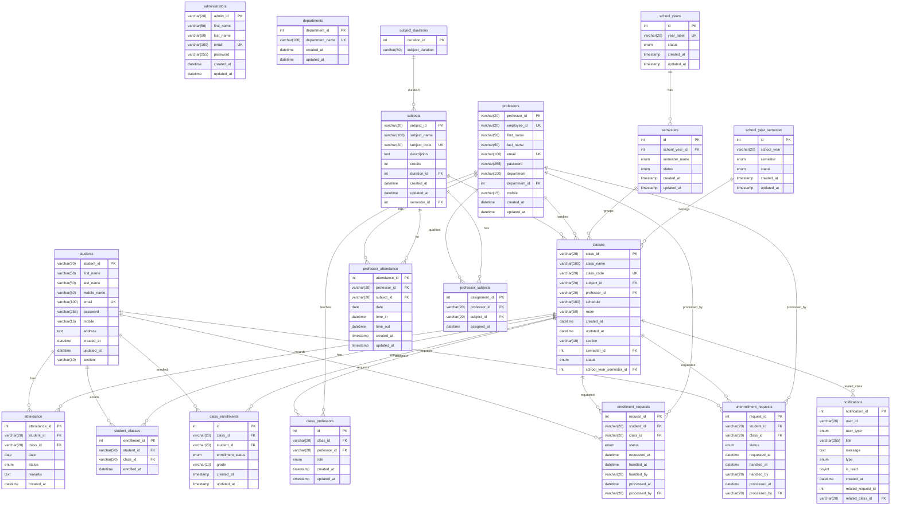

# GRC Student Portal – Enhanced ERD

This ERD reflects the latest schema from `backups/grc_student_portal_for_attendance_monitoring (9).sql` and consolidates relationships for clarity. Duplicate FK aliases in the dump (e.g., `attendance_ibfk_1` and `fk_attendance_student`) are shown as a single relationship.

## Mermaid ERD

## Notes
- Classes use both normalized `semesters` and legacy `school_year_semester` via `classes.semester_id` and `classes.school_year_semester_id`. The app appears to be transitioning; keep both until UI fully aligns.
- Several tables have duplicate FK definitions in the dump (different names, same columns). Functionally harmless but redundant. Consider pruning duplicates in a future migration for clarity.
